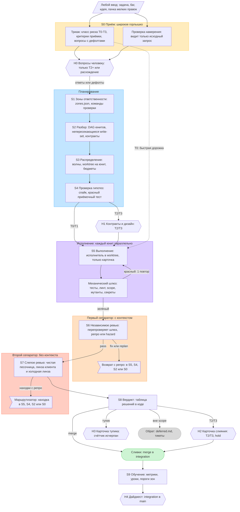
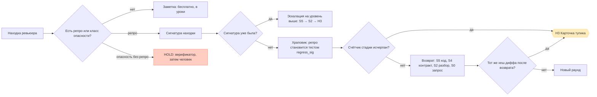
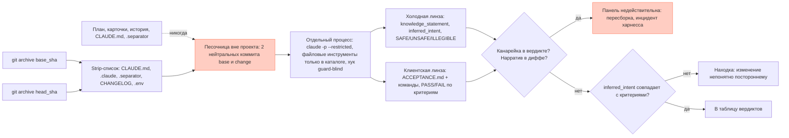

# Доска в FigJam: что уже есть и что добавить

Доска: https://www.figma.com/board/7VgCIMCMOK2WroyMvOEAxT — на ней основной конвейер (сгенерирован из Mermaid ниже).
Лимит вызовов Figma MCP на тарифе Starter был исчерпан в сессии сборки, поэтому секции 2–5 добавляются вручную
(FigJam → вставить Mermaid через плагин или `generate_diagram` с `fileKey=7VgCIMCMOK2WroyMvOEAxT`).

## 1. Основной конвейер (уже на доске)

## 2. Контроль циклов (добавить)

## 3. Протокол слепоты S7 (добавить)

## 4. Классы риска × стадии (таблица для доски)

| Класс | S2 | S4 | S6 | S7 | Слияние | Человек |
|---|---|---|---|---|---|---|
| T0 | 1 юнит | — | — | холодная | авто | H4 дайджест |
| T1 | да | да | 1 линза | клиентская | авто | H4 дайджест |
| T2 | + аудит | + проверка контракта | 2 линзы | клиентская + холодная | карточка | H1, H2 |
| T3 | + панель дизайнов | + план отката | 2 линзы | + security | карточка | H1, H2 |

## 5. Стикеры-принципы (по одному на стикер)

- Артефакты — единственная память.
- Кто пишет ≠ кто проверяет ≠ кто судит; обеспечено физически.
- Каждый шлюз объективен: код выхода, схема, множество, хеш.
- Свидетельства, не заявления: только записанные запуски.
- Тесты проверяют, а не определяют: acc_* и regress_* заморожены.
- Самое дешёвое опровержение — первым.
- Возвраты только вверх, со свидетельством, со счётчиком.
- Человек на цикле в пяти точках, а не внутри него.
- Строгость оплачивается классом риска.
- Утечка дефекта — единственная метрика, автоматически повышающая строгость.
